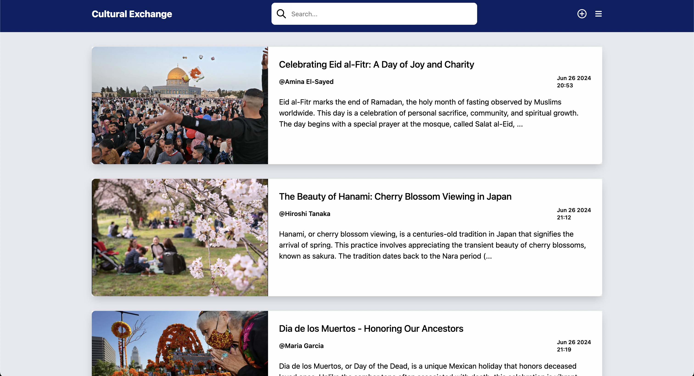

# Cultural Exchange Platform

## Description

The Cultural Exchange Platform is a blog application designed for international students from diverse backgrounds to share information about their cultural festivals and traditions. Built using the MERN stack, the platform aims to foster understanding and appreciation of various cultural backgrounds. The platform is equipped with several features to enhance accessibility and user engagement.

## Live Demo

Check out the live demo: [Cultural Exchange Platform](https://cultural-exchange-app.onrender.com)

> **Note:** The app might work slow due to the limitations of Render.com, which is a free cloud-based hosting provider service.

## Features

1. **Language Translation**: The platform supports multiple languages, making it accessible to users worldwide.
2. **Text to Audio**: Provides text-to-audio functionality for enhanced accessibility.
3. **User Engagement**: Users can engage with posts through the comments section.
4. **Post Management**: Users can create, edit, delete, and manage their posts.
5. **Authentication**: Utilizes JWT authentication for secure login and registration.
6. **Post Viewing**: Users need to log in to view the complete details of a post.
7. **Search Functionality**: Users can search for specific posts.

## Tech Stack

- **Frontend**: React.js
- **Backend**: Node.js, Express.js
- **Database**: MongoDB
- **Authentication**: JWT (JSON Web Tokens)
- **Middleware**: Various custom and third-party middlewares for enhanced functionality
